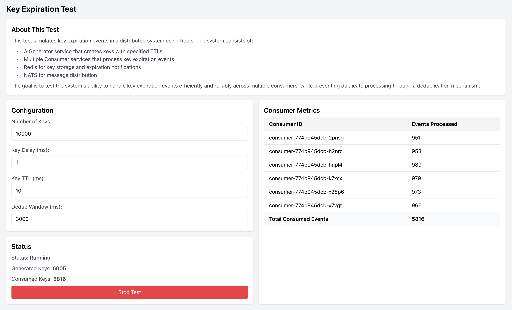

# Design Document

## Overview
This document describes the design of a system involving a generator and multiple consumers operating in a Kubernetes (k8s) environment. The system's primary goal is to generate Redis keys with expiration and process their expiration events for subsequent operations, while ensuring efficient and fault-tolerant design.



## Project Structure
```
.
├── cmd/                 # Command line applications
│   ├── generator/       # Generator service
│   └── consumer/        # Consumer service
├── docker/              # Docker related files
│   ├── Dockerfile.generator
│   └── Dockerfile.consumer
├── k8s/                 # Kubernetes manifests
│   ├── redis/           # Redis deployment
│   ├── nats/            # NATS deployment
│   ├── generator/       # Generator deployment
│   └── consumer/        # Consumer deployment
├── pkg/                 # Shared packages
│   ├── redis/           # Redis client
│   └── nats/            # NATS client
├── internal/            # Internal packages
│   └── metrics/         # Metrics tracking
└── web/                 # Web interface
    └── ui/              # React TypeScript UI
```

## Components

### 1. Generator Service
#### 1.1 WebUI
- **Framework**: The WebUI uses React with TypeScript and Tailwind CSS for styling
- **Features**:
  - Start and stop tests
  - Configure test parameters
  - Display real-time metrics and progress
  - Responsive design with light theme for better visibility
- **UI Components**:
  - Test configuration panel
  - Real-time metrics display
  - Progress bar with percentage
  - Start/Stop controls

#### 1.2 Test Functionality
- **Redis Key Generation**:
  - Key Pattern: `gen-key:<key seqnum>`
  - Configurable Parameters:
    - Number of keys to generate
    - Delay before each key (default: 1ms)
    - TTL for keys (default: 100ms)
    - De-duplication window (default: 5000ms) - This is the TTL for dedup keys
- **Metrics**:
  - Metrics stored in Redis:
    - `metrics:generated` - Counter for generated keys
    - `metrics:consumed` - Counter for consumed keys

#### 1.3 Test Execution
- **Execution Flow**:
  - The WebUI sends configuration parameters to the generator
  - The generator executes the test based on these configurations
  - Reset all testing metrics before starting each new test
  - Real-time status updates every second

### 2. Consumer Service
#### 2.1 Key Expiration Event Handling
- **Listeners**: Each consumer listens for Redis key expiration events
- **Key Pattern**: `gen-key:<key seqnum>`
- **Subscription**: Uses Redis Pub/Sub for `__keyevent@0__:expired` events

#### 2.2 De-duplication Key Creation
- **Key Pattern**: `dedup:<gen-key:<key seqnum>>`
- **Rules**:
  - Ignore expiration events for `dedup` keys
  - If a `gen-key` already has a corresponding `dedup` key, ignore its expiration event
  - If no `dedup` key exists:
    1. Create the `dedup` key in Redis
    2. Publish the expired `gen-key` name to a NATS JetStream stream

#### 2.3 NATS JetStream Integration
- **Stream**: `WORKGROUPPOLICY`
  - **Subjects**: `Stream.Workgroup.Policy.Events`
  - **Retention**: WorkQueue
  - **Storage**: Memory
  - **Max Age**: 24 hours
  - **Queue Group**: `key_expiration_processors`
- **Stream Management**:
  - Each consumer checks for stream existence on startup
  - Stream is created with WorkQueue policy if it doesn't exist
- **Message Distribution**:
  - Queue group subscription ensures even distribution
  - Manual acknowledgment for reliable processing
  - Maximum of 3 redelivery attempts
  - 5-second acknowledgment timeout
- **Concurrency Safety**: Ensure race-condition-safe operations when publishing messages

### 3. Redis Deployment
- **Environment**: Deploy Redis in a Kubernetes cluster using Docker Desktop
- **Configuration**:
  - Keyspace notifications enabled for expired events (`Ex`)
  - Resource limits:
    - CPU: 200m
    - Memory: 256Mi

### 4. NATS Deployment
- **Environment**: Deploy NATS in a Kubernetes cluster using Docker Desktop
- **Configuration**:
  - JetStream enabled
  - Monitoring port: 8222
  - Resource limits:
    - CPU: 200m
    - Memory: 512Mi

### 5. Development Environment
- **Platform**: MacOS
- **Tools**:
  - Docker Desktop for local Kubernetes cluster
  - Go 1.21 for backend services
  - Node.js for WebUI development
- **Languages and Frameworks**:
  - Backend: Go
  - Frontend: TypeScript, React, Tailwind CSS

### 6. Deployment Configurations
#### 6.1 Generator Service
- **Deployment**:
  - Single replica
  - Image built using multi-stage Dockerfile
  - Port-forward internal WebUI port to `localhost:30080` for local access
  - Resource limits:
    - CPU: 200m
    - Memory: 256Mi

#### 6.2 Consumer Service
- **Deployment**:
  - Six consumer instances by default
  - Resource limits per instance:
    - CPU: 200m
    - Memory: 256Mi

## Technical Considerations

### Scalability
- **Generator**: Configurable to handle varying workloads and Redis key generation rates
- **Consumers**: Horizontally scalable by increasing the number of pods in the deployment

### Fault Tolerance
- Use Kubernetes for automatic pod restarts and resource management
- Redis keys and NATS JetStream provide persistent event handling and state management
- Graceful shutdown handling in both services

### Concurrency and Synchronization
- **De-duplication Key Logic**:
  - Leverage Redis atomic operations to ensure thread-safe behavior
  - Prevent duplicate processing of `gen-key` expiration events
- **NATS JetStream**:
  - Employ message acknowledgment to guarantee reliable message processing

### Monitoring
- Implement metrics tracking using Redis counters:
  - `metrics:generated` - Track generated keys
  - `metrics:consumed` - Track consumed keys
- Real-time display on the generator WebUI with:
  - Current status
  - Key counts
  - Progress bar
  - Percentage completion

## Deployment Steps
1. **Redis**:
   - Create a Kubernetes deployment for Redis with keyspace notifications
2. **NATS**:
   - Deploy NATS with JetStream enabled
   - Configure the `KEEPALIVE_EXPIRATION` stream
3. **Generator Service**:
   - Build the WebUI
   - Create the Go service
   - Deploy to Kubernetes
   - Access WebUI via NodePort
4. **Consumer Service**:
   - Deploy six consumer instances
   - Verify Redis subscription and NATS connectivity

## Development Workflow
1. Set up MacOS development environment with Docker Desktop
2. Use kubectl to manage local Kubernetes clusters
3. Test individual components locally before deploying them in the cluster
4. Use multi-stage Dockerfiles from the `docker` directory for efficient builds
5. Build process:
   ```bash
   # Build images
   docker build -t generator:latest -f docker/Dockerfile.generator .
   docker build -t consumer:latest -f docker/Dockerfile.consumer .
   
   # Deploy to Kubernetes
   kubectl apply -f k8s/redis/deployment.yaml
   kubectl apply -f k8s/nats/deployment.yaml
   kubectl apply -f k8s/generator/deployment.yaml
   kubectl apply -f k8s/consumer/deployment.yaml
   ```

## Conclusion
This design ensures a robust and scalable system for generating and processing Redis keys, leveraging Kubernetes, Redis, and NATS JetStream for reliable and efficient operations. The WebUI provides a user-friendly interface for managing and monitoring the system, with real-time feedback and clear visibility of the test progress.
